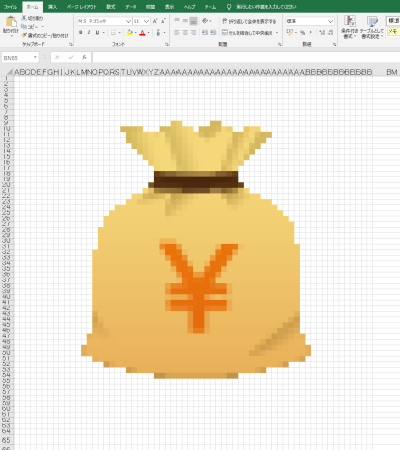

# Make_Excel_PixelArt
## 画像ファイルから、シートのセル色で表現したExcelファイルに変換するコード

Excelシートの「セル色でドット絵を作る」を、画像から変換するコードです

こういったアイコン画像を読み込み、  
ドット絵で表現したExcelシートを作成することができます。  
出力結果は、icon_3g_64.xlsxをご覧ください

https://maxigundan.com/deeplearning/?p=90

↑ 詳しい説明はこちら

## 実行方法

`python make_excel.py image_file(.png/gif/jpg)`  
→ image_file.xlsx が生成されます

## 注意事項
写真のようなフルカラーも変換できますが、  
古いExcelだとセル色設定の最大個数があるらしく、  
その値を超えると「ファイルが壊れている」になりました。  
Excel2016だと大丈夫で、2010だとエラーになったりしました。

## 設定

GRID_SIZE の値を変更することで、マス目の大きさを変えられます

